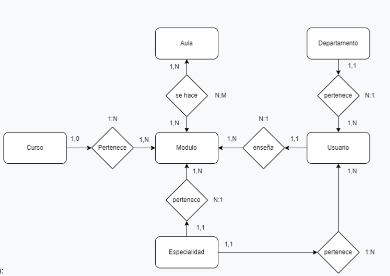

# Proyecto de Gestión de Horarios para CIFP Majada Marcial

## Descripción del Proyecto
Este proyecto consiste en el diseño e implementación de una aplicación web full stack para la gestión de la elección de horarios del profesorado del CIFP Majada Marcial. Se utilizará el stack Javascript + Laravel con MariaDB como SGBD.

## Funcionalidades
### Inicio de Sesión
- Los usuarios pueden iniciar sesión, mientras que el registro lo realizará el administrador de la plataforma.   :white_check_mark:

### Carga automática de datos en el formulario.  :white_check_mark:

### Restricciones de Horario
- Se prohíbe tener más de 30 horas semanales en un aula.  :x:
- Se establecen restricciones específicas como la participación del profesorado tutor, límites de horas semanales, elección de aula/taller, etc. :x:

### Automatización de Campos
- El sistema debe autocompletar ciertos campos según la selección del usuario.  :white_check_mark:

### Generación y Validación del Horario
- Se deben generar horarios de acuerdo con las horas semanales de los módulos, limitando 3 horas seguidas.  :white_check_mark:
- Se debe validar que el total de horas sume entre 17 y 20 horas, indicando errores mediante colores. :x:

### Informes y Vistas para el Jefe de Departamento y Jefe de Estudios
- El jefe de departamento puede ver y editar horarios de los docentes de su departamento. :x:
- El jefe de estudios puede obtener informes sobre la asignación de horas por aula, ver horarios de docentes, y más. :x:

## Modelo de Datos
Se parte de un modelo de datos base y se agregan tablas y relaciones necesarias para cumplir con los requerimientos funcionales.
--

--

## Requerimientos Técnicos
### Despliegue
El proyecto debe ser desplegado para su acceso público utilizando una de las siguientes opciones: IaaS, IaaC o PaaS. :x:

### Funcionalidades Técnicas
- Uso de seeders y factories. :white_check_mark:
- Agrupamiento de rutas y middleware auth. :x:
- Autenticación en API mediante Passport o Sanctum. :white_check_mark:
- Validación de datos con FormRequest. :white_check_mark: 
- Recursos JS y CSS accesibles mediante Vite. 
- Gestión de autorizaciones por roles. :x:
- Uso de Eloquent Resources, códigos HTTP específicos, comentarios, etc. :white_check_mark: 
- Código fuente disponible en BitBucket/GitHub. :white_check_mark: 

## Memoria Técnica :x:
La memoria técnica debe incluir:
- Portada
- Introducción
- Diseño e implementación
- Problemas encontrados
- Trabajo futuro y conclusiones
- Documentación de acceso al proyecto y enlaces al repositorio.

## Autoevaluación :x:
Se debe subir una autoevaluación explicando la nota a la que optas y las razones para ello.

## Notas Finales por Asignatura
- DSW: Implementación, funcionalidades y defensa.
- DPL: Despliegue, memoria y defensa.
- DEW: Desarrollo de vistas y funcionalidades, funcionalidades adicionales, memoria y defensa.

